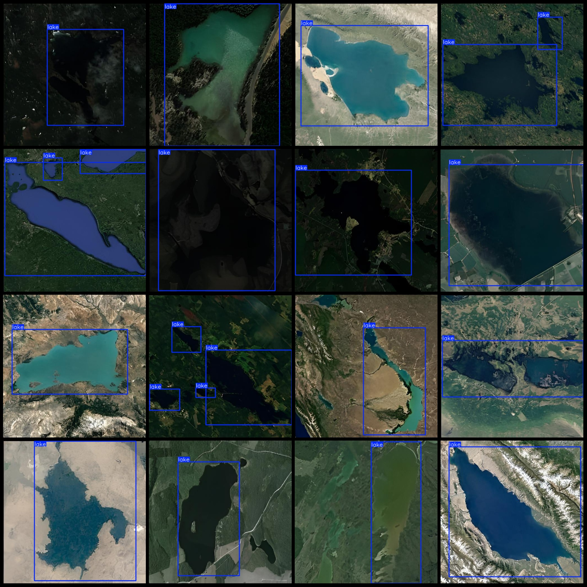
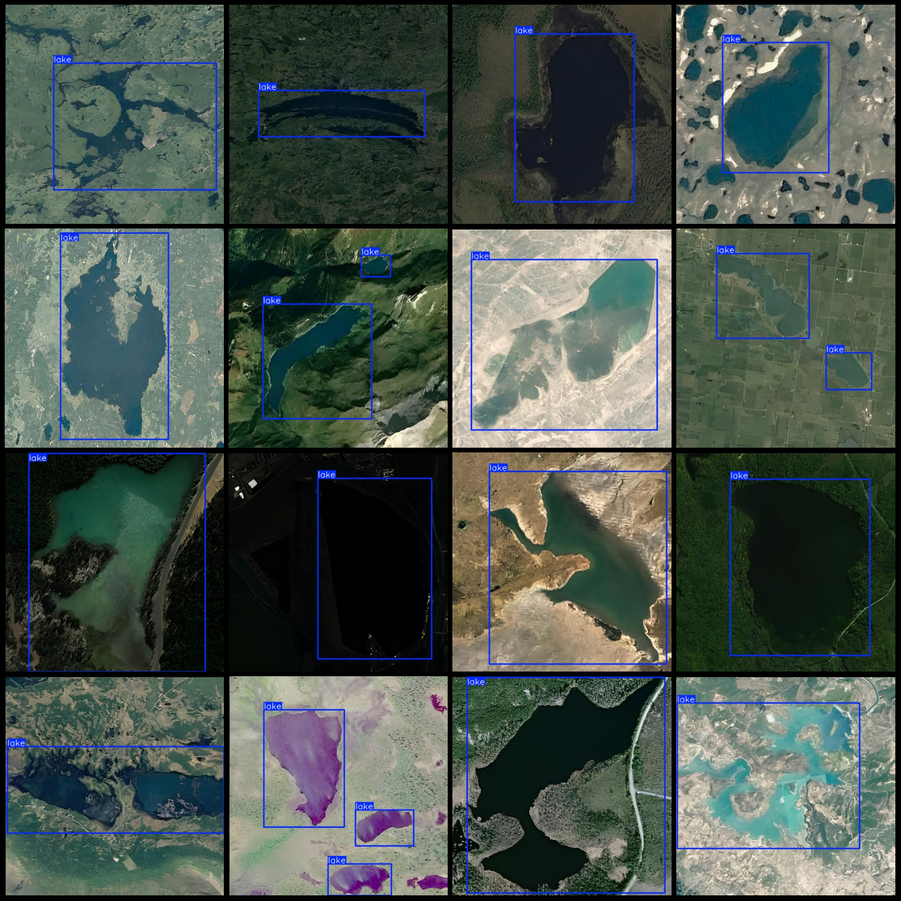

# Remote Sensing Lake Detection Dataset VOC+YOLO Format 165 Images 1 Classification

Dataset format: Pascal VOC format + YOLO format (excluding split paths in txt files, only containing jpg images and corresponding VOC format xml files and YOLO format txt files)
Number of images (jpg file count): 165
Number of labels (xml file count): 165
Number of labels (txt file count): 165
Number of label categories: 1
Label category name: ["lake"]
Number of bounding boxes per category:
lake = 211
Total bounding boxes: 211
Number of images per category:
lake = 165
Image resolution: 512x512
Using labeling tool: labelImg
Labeling rule: Drawing bounding boxes for each category
Special note: The dataset does not contain training, validation, or test sets; they need to be manually divided.
Special declaration: This dataset does not guarantee the accuracy of the trained models or weight files.
Image preview:
Label example:
## Images

Here is a pay link on Stripe ( https://buy.stripe.com/3cs8yP7sY87d0vu9AB ). Please contact me lonlonago@foxmail.com after funding $89, and I will send you a complete data files , thank you!

